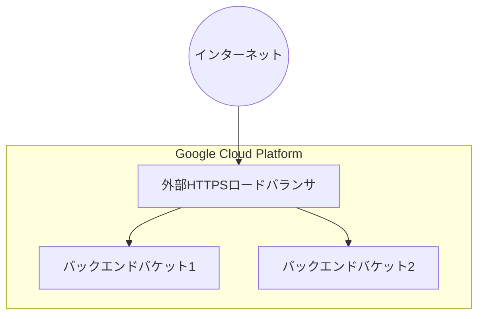
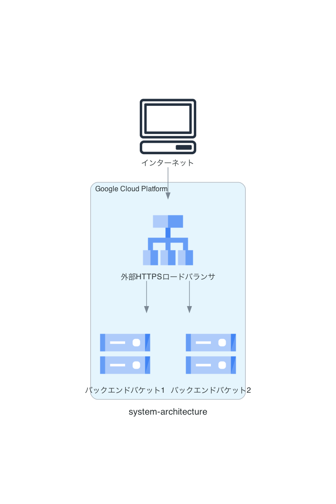

以下サイトのterraform練習  
main.tfではなくいくつかのファイルにリファクタリングしている.  
https://cloud.google.com/load-balancing/docs/https/ext-load-balancer-backend-buckets?hl=ja

## システムアーキテクチャ



システムアーキテクチャ図 by diagram.py


# Terraform

## 実行
```
# terraform plan -- 実行前の確認用
terraform apply
```

## クリーンアップ
```
terraform destory
```

# rye

## 仮想環境のアクティベート
```
. .venv/bin/activate
```

(無効化する場合)
```
deactivate
```

## パッケージの同期
```
rye sync
```

## パッケージの追加
```
rye add diagrams
```

## スクリプトの実行
```
rye run python diagram.py 
```
